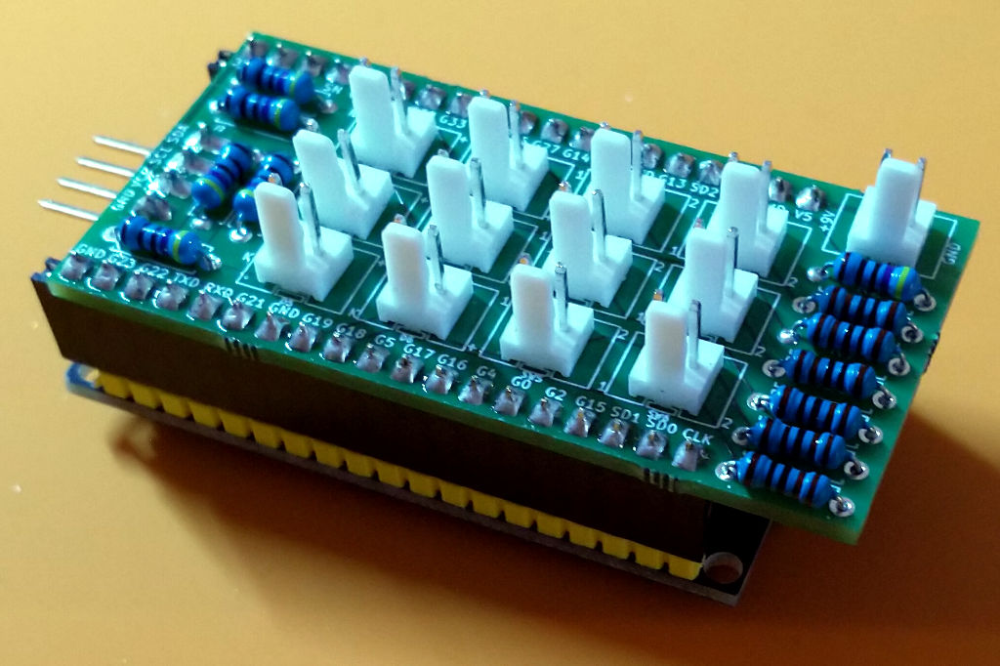
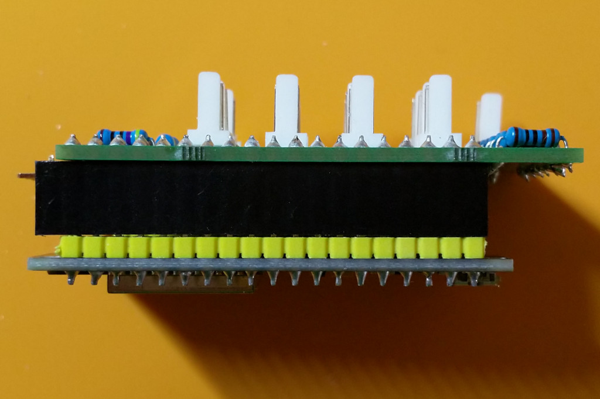
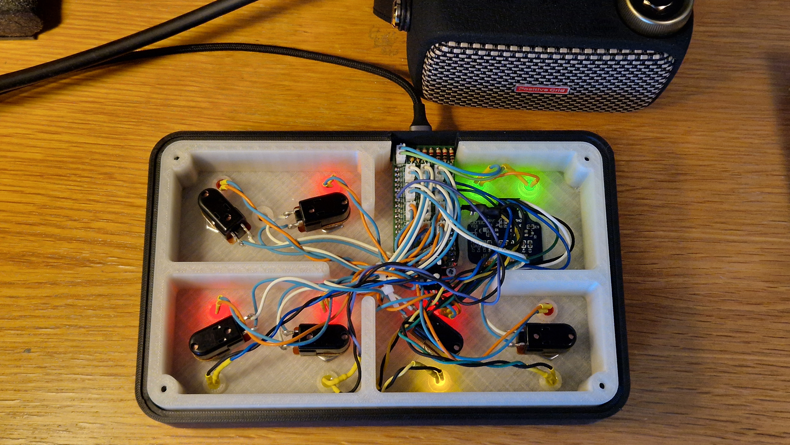

# Ignitron - Hardware
This document describes the hardware side of the **Ignitron** foot pedal.

The software that controls the Spark amp runs on an ESP32 microcontroller which needs to be connected to the actual hardware so that it's able to react to hardware events, e.g. foot switch presses, and to indicate the current state via the LEDs. All of these connections, except the power supply via USB, are made via a PCB that piggybacks onto the ESP32 board.

One objective of the PCB design was to keep things as modular as possible. This means that no cables coming from the hardware should be soldered directly to the PCB or the ESP32. For example the foot switches, LEDs and the external power supply are supposed to be connected by PCB connectors that can be connected and disconnected. In case you cannot find such connectors you can of course still solder the cables directly to the PCB.

  
  

## Bill of Materials (BOM)
To keep things clean the bill of materials will differentiate between hardware like the enclosure, switches, etc. and everything that's needed to assemble the PCB.

### Hardware
|Component|Quantity|Comment|
|---|:---:|---|
|[ESP32](https://www.berrybase.de/dev.-boards/esp8266-esp32-d1-mini/boards/esp32-nodemcu-development-board)|1|Make sure that the dimensions and pin order matches with the PCB (details below).
|[SSD1306 OLED Display 128x64 0.96"](https://www.amazon.de/AZDelivery-Display-Arduino-Raspberry-gratis/dp/B074N9VLZX)|1|Make sure that the dimensions of the display you choose fit the OLED frame!
|[1590DD Enclosure](https://www.taydaelectronics.com/hardware/enclosures/1590dd-style/matte-black-1590dd-style-aluminum-diecast-enclosure.html)|1|
|[SPST Momentary Footswitch](https://www.taydaelectronics.com/spst-momentary-soft-touch-push-button-stomp-foots-pedal-switch.html)|6|
|[LED 5mm](https://www.taydaelectronics.com/leds/round-leds/5mm-leds.html)|6|
|[LED Holder](https://www.reichelt.de/einbaufassung-fuer-5-mm-leds-aussenreflektor-chrom-ebf-a-5-p7288.html?&trstct=pol_3&nbc=1)|6|
|[DC Power Jack](https://www.taydaelectronics.com/hardware/dc-power/dc-power-jack-2-1mm-enclosed-frame-with-switch-red.html)|1|Optional if you only want to power via USB using the adapter.|
|[USB Adapter Cliff CP30208N](https://www.reichelt.de/usb-adapter-ft-1-x-usb-2-0-a-buchse-1-x-usb-2-0-a-buchse-cliff-cp30208n-p227645.html)|1|Optional if you only want to power using the DC power jack.
|USB A to Micro USB Cable|1|Optional if you only want to power using the DC power jack.
|OLED Frame|1|Details below.

### PCB
The PCB is provided as a KiCad PCB project ([Ignitron.kicad_pcb](Ignitron.kicad_pcb)) and must be manufactured at a service that supports [KiCad](https://www.kicad.org/) projects. This can for example be [OSH Park](https://oshpark.com/) (if you are located in the USA), [Aisler](https://aisler.net/) (if you are located in Europe). Just download the PCB project [Ignitron.kicad_pcb](Ignitron.kicad_pcb) from this site and and upload it to the service that you want to use.

The schematics for the PCB can be found [here](Ignitron-Schematics.pdf).

To populate the PCB itself you will need the following components:

|Ref|Quantity|Component|Value|Comment|
|:---:|:---:|---|:---:|---|
|D1, D2, D3, D4, D5, D6|6|[PCB connector with two pins](https://www.reichelt.de/platinensteckverbinder-gerade-weiss-2-polig-ps-25-2g-ws-p14825.html)|-|Alternatively connect the LEDs directly with cables|
|SW1, SW2, SW3, SW4, SW5, SW6|6|[PCB connector with two pins](https://www.reichelt.de/platinensteckverbinder-gerade-weiss-2-polig-ps-25-2g-ws-p14825.html)|-|Alternatively connect the switches directly with cables|
|J1|1|[PCB connector with two pins](https://www.reichelt.de/platinensteckverbinder-gerade-weiss-2-polig-ps-25-2g-ws-p14825.html)|-|Alternatively connect the power jack directly with a cable|
|J2|1|[1x4 angled pin header](https://www.taydaelectronics.com/connectors-sockets/pin-headers/40-pin-2-54-mm-angle-single-row-pin-header.html)|-|For the connection of the OLED display. Solder to lower side to be able to read the values on the top|
|IC1|2|[1x19 female pin header](https://www.taydaelectronics.com/connectors-sockets/pin-headers/20-pin-2-54-mm-single-row-female-pin-header.html)|-|If possible get two 1x19 headers. Otherwise use 1x20 headers and cut off the unused leg.|
|R1, R2, R3, R4, R5, R6|6|¼ W Resistor|470R|Resistors for the "Drive" (R1), "Mod" (R2), "Delay" (R3), "Reverb" (R4), "Noise Gate" (R5) and "Comp" (R6) LEDs. Match with the actual LEDs.|
|R7, R8, R9, R10, R11, R12|6|¼ W Resistor|1K|Resistors for the switches|

  
  

### OLED Frame
The OLED frame was designed with [OpenSCAD](https://openscad.org/). The project file is [tinyOledBezel.scad](tinyOledBezel.scad) which is an adjusted version of [this design](https://www.thingiverse.com/thing:1645893).

The final STL file that can be printed at a 3D printing service is [tinyOledBezel.stl](tinyOledBezel.stl). If you are located in Germany you can for example get it printed at [FDM Druckservice](https://fdm-druckservice.de/produkt/fdm-designer).

The design consists of the actual frame and two bars that can be used to hold the display in place. Snap off the bars and the connector so that you are left with the frame and the two bars.

# Enclosure
The following assumes that the enclosure will be ordered at Tayda Electronics. Order the following hardware/services on their [main page](https://www.taydaelectronics.com/).
* A 1590DD enclosure. The pictures show a [matte black](https://www.taydaelectronics.com/hardware/enclosures/1590dd-style/matte-black-1590dd-style-aluminum-diecast-enclosure.html) enclosure.
* [Drill service](https://www.taydaelectronics.com/hardware/enclosures/enclosure-custom-drill-service/1590dd-custom-drill-enclosure-service.html)
* [UV printing service](https://www.taydaelectronics.com/hardware/enclosures/enclosure-uv-printing-service/1590dd-uv-printing-service.html)
* [Gloss layer](https://www.taydaelectronics.com/hardware/enclosures/enclosure-uv-printing-service/custom-uv-gloss-layer-service.html)

Once you have ordered the items listed above go to [Tayda Tool Box](https://drill.taydakits.com) page and create a drill and print template.

## Drill template
Setup a drill template with the following holes:
|Element|Side|Diameter (mm)| X Position (mm)|Y Position (mm)|
|---|:---:|:---:|:---:|:---:|
|LED Drive|A|8.2|10|-75|
|LED Mod|A|8.2|10|-25|
|LED Delay|A|8.2|10|25|
|LED Reverb|A|8.2|10|75|
|LED Noise|A|8.2|-47|25|
|LED Comp|A|8.2|-47|75|
|Switch Drive|A|12.2|36.5|-75|
|Switch Mod|A|12.2|36.5|-25|
|Switch Delay|A|12.2|36.5|25|
|Switch Reverb|A|12.2|36.5|75|
|Switch Noise|A|12.2|-20.5|25|
|Switch Comp|A|12.2|-20.5|75|
|Display Large|A|32.2|-20.5|-64.2|
|Display Small 1|A|5.4|-7.2|-50.9|
|Display Small 2|A|5.4|-33.8|-50.9|
|Display Small 3|A|5.4|-33.8|-77.5|
|Display Small 4|A|5.4|-7.2|-77.5|
|USB Body|C|24.2|0|50|
|USB Screw 1|C|3|-9.5|62|
|USB Screw 2|C|3|9.5|38|
|Power|C|12.2|0|-75|

## UV print
Download [Ignitron-UV-Print.pdf](Ignitron-UV-Print.pdf) from this site and upload it as a UV print template at the [Tayda Tool Box](https://drill.taydakits.com).

⚠️ Please note that you must use a PDF viewer that supports layers if you want to take a look at the PDF on your computer. Otherwise you will likely only see the GLOSS layer which covers the actual design. If you open the PDF with a recent version of Firefox you should be able to switch the layers on and off.

## Connect the drill and design template with the order
A few minutes after you have placed your order at Tayda it should be possible to connect the services from your order with the templates that you have just created. Follow the instructions on the [Tayda Tool Box](https://drill.taydakits.com) page.

# Assembly
The following assumes that you have received the UV printed and drilled enclosure from Tayda and that you have everything else from the BOM.

## Enclosure preparation
The display (frame) needs a rectangular hole in the enclosure but unfortunately it is not possible to order rectangular holes at Tayda Electronics. Therefore it is necessary to manually file away the excess material that could not be removed by the round drills in the area of the display hole. Try to file away only so much material that the OLED frame fits and can be snapped into the hole without having to glue anything. Also make sure that the enclosure is not scratched by scrap material.
1. Cover the whole enclosure except for the display hole area with tape.
2. File away the excess material. If you have used the provided enclosure design then the area where the display will be located is printed in white. File away (almost) all white material in that case.
3. Once you have made sure that the OLED frame fits carefully remove the tape and clear the enclosure, e.g. by holding it under running water. Make sure that the enclosure is not scratched by scrap material!

## PCB assembly
Follow these steps to solder the PCB:
1. Solder the resistors R1 - R6. These are for the LEDs and you might need to adjust their values to adjust the brightness of the chosen LEDs.
2. Solder the resistors R7 - R12. These are all 1 K resistors for the switches.
3. Solder the receiving ends of the PCB connectors D1 - D6, SW1 - SW6 and J1.
4. Solder the two 1x19 female pin headers. Please note that these go on the "lower" side of the board that says "IC1"! In general make sure that they are soldered in such a way that you can connect corresponding pins on the ESP32 and the PCB, i.e. 3V3 goes to 3V3, GND goes to GND, etc.
To make sure that the headers fit well on the ESP32 once they are soldered to the PCB you can lay the ESP32 on it's back, put the two headers on it and then put the PCB on top of that to solders the first few points. If you need to use 1x20 headers the two excess pins will be in the area of the 3V3 and GND pin. Snap their electrical contacts once you have soldered the headers to the board.
6. Solder the 1x4 angled pin header to J2. Attach it to the "lower" side of the board so that you can still read the values on the "upper" side of the board.

## Final assembly
Once the enclosure is prepared and the PCB is assembled we can finally put everything together. On the [main page](https://www.github.com/stangreg/Ignitron) you can find an image that shows how everything is fit into the enclosure and what goes where.
1. Put the OLED display into the OLED frame, secure it with the bars and put the frame with the display into the enclosure.
2. Put some insulating tape in the area where the ESP32 with the attached PCB will go.
3. Install the LEDs and switches into the enclosure and measure how long the cables of the PCB connectors must be for each of them so they reach the PCB. Please refer to the resistor listings for R1 - R6 in the PCB BOM on how the numbers are mapped to "Drive", "Mod", etc. Example: SW1 refers to the switch for "Drive", D1 refer to the LED for "Drive".
4. Take out the switches again to make it easier to solder them later. Keep the LEDs inside because you will need to solder them in an installed state anyway.
5. Install the USB adapter if you want to use it.
6. Solder the PCB connectors to the switches. The order of the cables does not matter in this case.
7. Solder the PCB connectors to the installed LEDs.
⚠️ Please note that the order matters in this case because the connector will only connect to the receiver in one way! If you connect it the wrong way then the LEDs will not light up.
8. Solder the PCB connector to the power jack if you want to use it.
⚠️ As with the LEDs order matters here!
10. Install the switches into the enclosure again.
11. Install the power jack if you want to use it.
12. Connect the LEDs correctly to D1 - D6, the switches to SW1 - SW6 and the power jack to J1.
13. Connect the display to the PCB.
14. Use the USB A to Micro-USB cable to connect the adapter to the ESP32.
15. Close the enclosure.

Test everything.

## Additional Features

### Battery Indicator

Starting from version 1.7.2, Ignitron can be powered by an internal battery pack and displays the remaining capacity on the LED screen.

This section explains how to build the hardware for this feature. To enable it in software, see [this guide](../src/Readme.md#battery-indicator).

#### BOM

| Component         | Quantity | Comment                                      |
|-------------------|:--------:|----------------------------------------------|
| 5.5*2.1 DC Jack   | x        | Optional. To power other pedals.             |
| 5.1k resistor     | 1        | For voltage divider.                         |
| 15k resistor      | 1        | For voltage divider.                         |
| Battery pack      | 1        | Supports 2S and 3S Li-ion or LiFePO4 packs.  |
| LDO module, e.g., LM317 | x  | Optional. To reduce voltage for pedals.      |
| AMS1117 5.0       | 1        | For powering ESP32.                          |
| Power switch      | 1        | Power switch.                                |

Choose the battery pack: If your pedals require 9V, a 2S Li-ion pack is a good choice as it matches the discharge profile of a 9V alkaline battery. For 12V pedals, use a 3S Li-ion pack and add an LDO to reduce the output voltage to 9V for 9V pedals. If you don't need power output, choose any battery that provides more than 5V.

Why use a 2S/3S battery pack with an LDO instead of a 1S battery with a voltage booster? LDOs do not introduce audible buzz like voltage boost chips, although they waste more energy as heat.

#### Connection

See [Ignitron-Battery-Indicator-Schematics.pdf](./Ignitron-Battery-Indicator-Schematics.pdf) for details.

### 3D Printed case

Link to Thingiverse: [Ignitron case - foot pedal for Positive Grid Spark amps](https://www.thingiverse.com/thing:6952547)

A 3D printed case that is custom made for **Ignitron** is contributed by user @Barsk (orginal design by @Intaker). Note that the design is made for a 1.3" OLED display (original design uses 0.96") and a 38 pin ESP32 devkit board featuring four mounting holes. There are many clones and any with the same dimension will do. A version without the holes *may* work, it is untested though and migh t need some hot glue perhaps for mounting. 

The case is designed to power the ESP32 board directly by its own USB port, which is available from a port in the outer casing. 

The case is made with an internal part that needs to be printed with a translucent filament so the LEDs can shine through. Natural PLA (uncolored transparent) works fine, transparent PETG is an option. The outer shell should be printed in an opaque color of choice. It is easy to print outer shells in various colors and change the "skin" of the Ignatron. The texts for TUNER, MAN FX, AMP, Reboot icon, LOOPER and Bank Up/Down is punched by default and will work fine if a simple one filament print is used. There is also the possibility (and recommended if you have the possibility) to print the texts with a contrasting color to make it more readable. Please view the [thingiverse pages](https://www.thingiverse.com/thing:6952547) for more information.

There are two LED slots for lighting the **Ignitron** label on the case. The following approach is suggested. The LEDs can be powered from the +5V pin on the ESP32 which is fed from USB power. Solder a wire to +5V and to one of the GND pins and put the two LEDs in series with a 47 ohm resistor (suitable for 5mm  red, yellow or green). Note that blue leds do not work here since they have to high forward voltage drop. 
The suggested approach is to use the J1 connector (if the PCB is used) that is unused since we instead power directly from USB. The J1 connector is already connected to +5V and GND.

### Optional dedicated Preset LEDs 
The case also has mounting sockets for 4 extra dedicated preset LEDs. To *enable this optional functionality in the firmware please see the related section under the source Readme*. If enabled it also *modifies* the behaviour of **Ignatron** to light up the FX LEDs for the selected preset instead of displaying the FX symbols in the OLED display. This way it is easy to see which Preset slot is used and exactly which FX pedals that are in use as each of them are lit by its own LED. If choosing not to use this optional functionality then just leave those extra sockets empty.

The LEDs has no connections on the PCB as this is a new addition to the functionality. Instead you need to solder the wires for the LEDs directly to the bare pins on the ESP32 board. The wires need to have the LED and a 470 ohm resistor in series. Make sure to use heat shrinkable tubes where approriate so not to short out anything. Each LED needs a connection to a GPIO pin + LED + resistor and then to ground. Make sure to connect the cathod leg to ground otherwise the LED will not light up.

|Preset slot| GPIO|
|-----------|-----|
|          1|    0|
|          2|    4|
|          3|   12|
|          4|   15|    

#### Hardware (BOM)
The printed 3D case uses the same ESP32 board as the orginal design above. Same foot switches and same LEDs for the FX pedal sockets. In addition there are two extra 5 mm green LEDs (for the IGNITRON label) these are connected in series with one 47 ohm 1/4W resistor. Four yellow 5 mm LEDs for the preset LEDs and four 470 ohm 1/4W resistors (optional)).
The OLED display is replaced by a larger SH1106 1.3" 128x64 i2C OLED.

The orginal enclosure, LED holder, USB jack and OLED frame are not used with the 3D printed case.